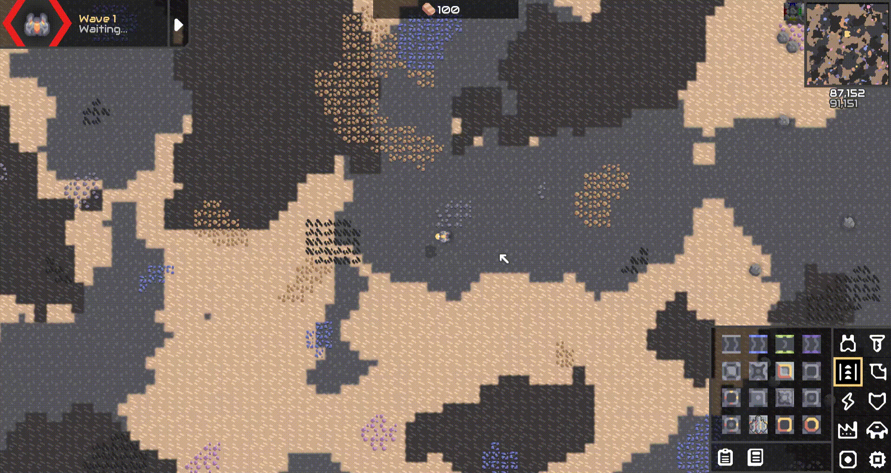
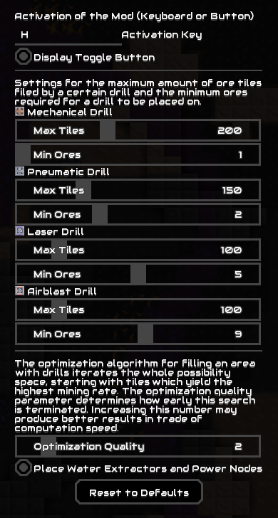

# Auto Drill

Mindustry Mod which adds tools to automatically fill a resource patch with drills.

Enable the mod by the activation key (default `H`) or by clicking the activation button next to the minimap.
When activated, clicking on any tile will display a toolbar with the drills the current tile can be mined with.
The mechanical drill and pneumatic drill buttons fill the resource patch with drills, and a bridge layout facing in the picked direction.

The laser and airblast drill buttons fill the resource patch with drills and places water extractors and power node adjacent to each drill if possible.

For Erekir the mod enables you to automatically fill wall resources

The mod has several configuration options.

- **Activation Key** 
  
  The key with which the mod is toggled

- **Display Toggle Button**
  
  Whether to display the toggle button
  
- **Max Tiles** 
  
  The maximum number of tiles that are flood filled and later filled with drills, highly effects performance

- **Minimum Ores per Mechanical/Pneumatic/Laser/Airblast Drill** 
  
  The minimum amount of resource tiles any drill must cover

- **Optimization Quality** 
  
  The optimization algorithm for filling an area with drills iterates the whole possibility space, starting with tiles which yield the highest mining rate. The optimization quality parameter determines how early this search is terminated. Increasing this number may produce better results in trade of computation speed.

- **Place Water Extractors and Power Nodes** 
  
  Whether to place water extractors and power nodes next to the drills

